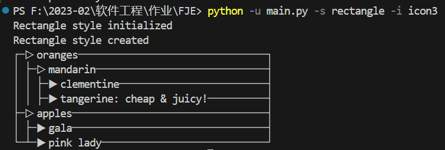
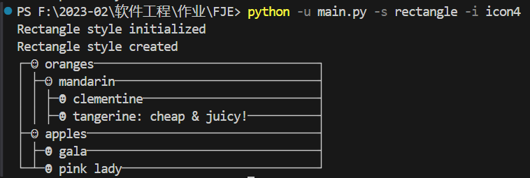
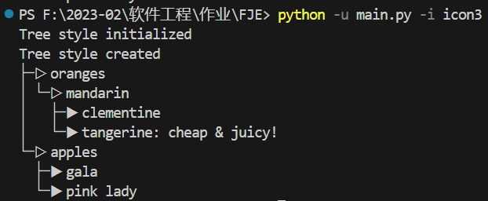
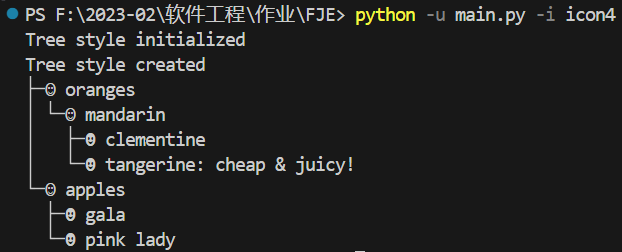
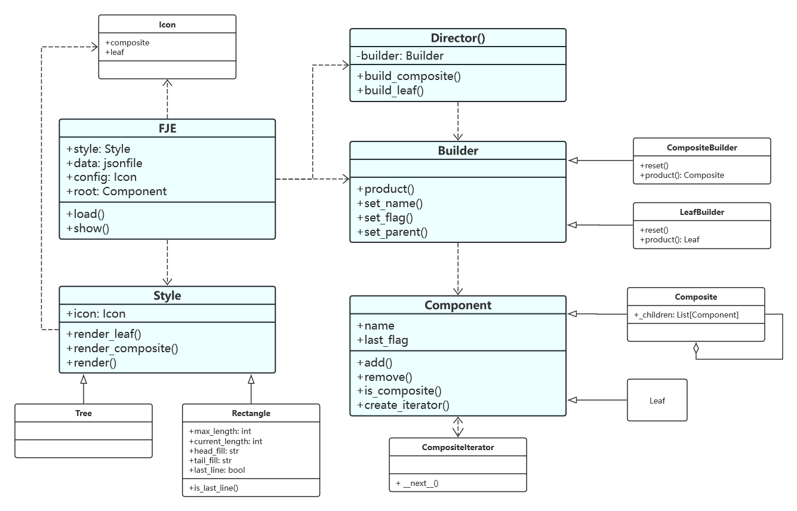

# Funny JSON Explorer

## 运行

`python main.py -f <file> -s <style> -i <icon>`

`<file>` 为JSON文件的路径

`<style>` 可选`tree` 和 `rectangle`，默认为`tree`

`<icon>` 可选`icon1` ~ `icon4`，默认为`icon1`

在`config.json`中可以添加或修改图标组类型

## 结果示例

 

 

## 类图

